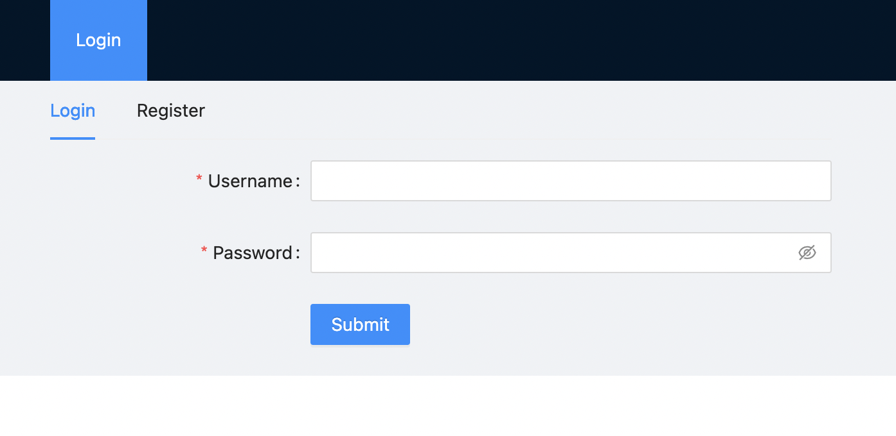
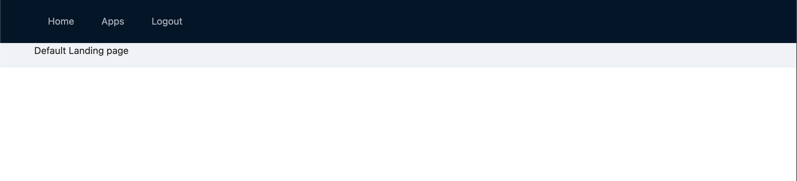
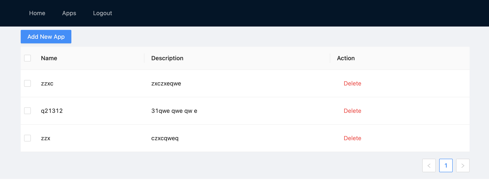

# Apps Gallery Frontend+Backend 

## Demo screenshots




## Installing / Getting started

In order to setup the project you will need the following technologies installed:
- Docker
- docker-compose
- docker
- git
- make

```shell
cp .env.example .env
git submodule update --init --recursive
make run
```

Building the services might take a while as it needs to pull the dependencies before it can run.

**Note: the make run command might fail if the some services are not yet up so you might need to manually trigger the final steps of make run on below commands**

```shell
make migrate
make seed
```

**migrate** - will be responsible for generating the tables
**seed** - will be responsible for populating the table with data, but here we didn't add any seeder


# Where to find them?
Api service will be built on - http://localhost:3002

Client service will be build on http://localhost:3000, this would probably take the longest to get up and running.

This configuration can be changed in the `.env` file.

## .env variables (these can be changed to your preference)

| Variable  | default value  | description |
|---|---|---|
|  REACT_APP_API_URL | http://localhost:3002/api/v1  | endpoint used by the client-service to connect to the api-service
|  CLIENT_PORT | 3000  | port used by client-service |
|  API_PORT |  3002 | port used by api-service |
|  POSTGRES_DOCKER_IMAGE |  postgres:12 | default postgres docker image version |
|  POSTGRES_PASSWORD |  password | postgres password |
|  POSTGRES_DB |  development | postgres db variable which will be used as default db when initializing the container image |
|  POSTGRES_PORT |  5432 | default postgres port |
